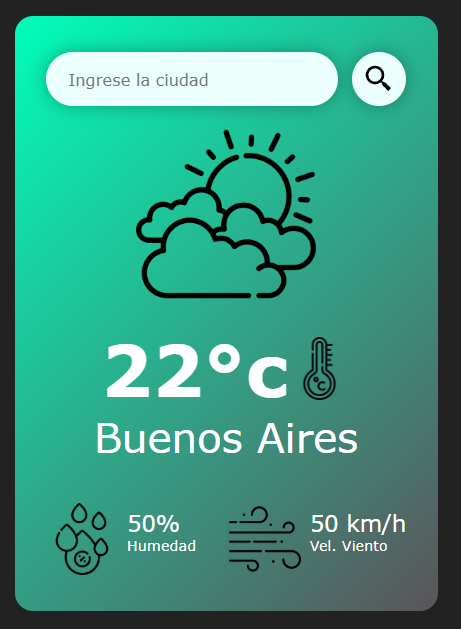

# App Clima

Una aplicación web simple que muestra el clima actual de una ciudad utilizando la API de OpenWeatherMap.

## Capturas de Pantalla



## Características

- Buscar el clima actual de cualquier ciudad.
- Mostrar la temperatura, humedad y velocidad del viento.
- Cambiar la imagen del clima en función de la temperatura.

## Tecnologías Utilizadas

- HTML
- CSS
- JavaScript
- API de OpenWeatherMap

## Detalle de los Pasos Seguidos

### Estructura HTML:

- Se crea una estructura básica de HTML con un contenedor principal .card que incluye un campo de entrada para la ciudad, un botón de búsqueda, y secciones para mostrar la información del clima.

### Estilos CSS:

- Se aplican estilos para dar formato a la tarjeta del clima, el campo de entrada, el botón de búsqueda y las secciones de información del clima.
- Se utiliza linear-gradient para el fondo de la tarjeta y drop-shadow para agregar sombras a los elementos.

### JavaScript:

- Se añade un evento DOMContentLoaded para asegurar que el DOM esté completamente cargado antes de ejecutar el código.
- Se define la función obtenerClima que realiza una solicitud a la API de OpenWeatherMap para obtener los datos del clima de la ciudad ingresada.
- Se actualizan los elementos del DOM con los datos obtenidos de la API.
- Se añaden eventos click y keydown para realizar la búsqueda del clima cuando se hace clic en el botón de búsqueda o se presiona la tecla "Enter".

## Instalación

1. Clona el repositorio:
   ```bash
   git clone https://github.com/ricardoamena/appclima-v1
   ```

## Navega al directorio del proyecto:

Abre index.html en tu navegador.

## Uso

Ingresa el nombre de una ciudad en el campo de entrada.
Haz clic en el botón de búsqueda o presiona la tecla "Enter".
La aplicación mostrará el clima actual de la ciudad ingresada.

## Contribución

Haz un fork del proyecto.
Crea una nueva rama (git checkout -b feature/nueva-caracteristica).
Realiza tus cambios y haz commit (git commit -am 'Añadir nueva característica').
Sube tus cambios (git push origin feature/nueva-caracteristica).
Abre un Pull Request.
Licencia
Este proyecto está bajo la Licencia MIT.

## Contacto

Nombre: Ricardo Alexandro Mena
Correo: ricardoamena@gmail.com
GitHub: [Ricardo Alexandro Mena](https://github.com/ricardoamena)
